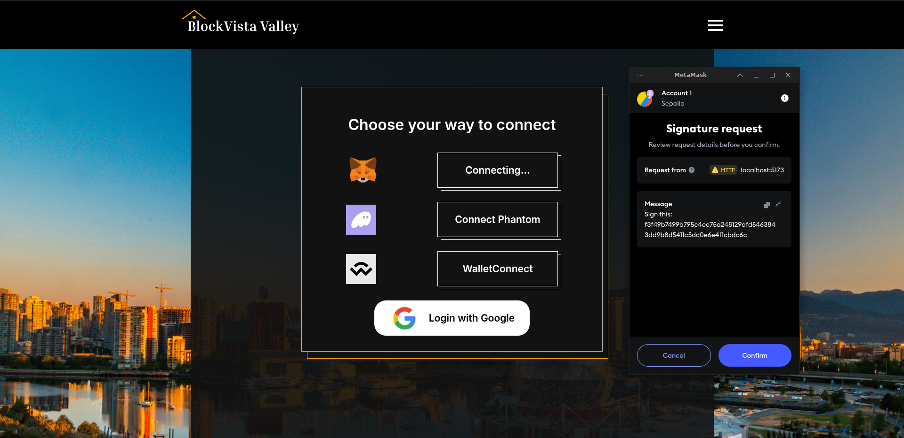
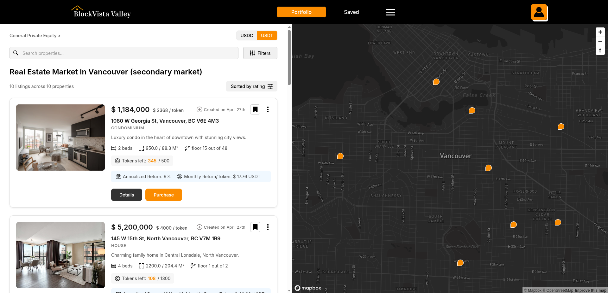
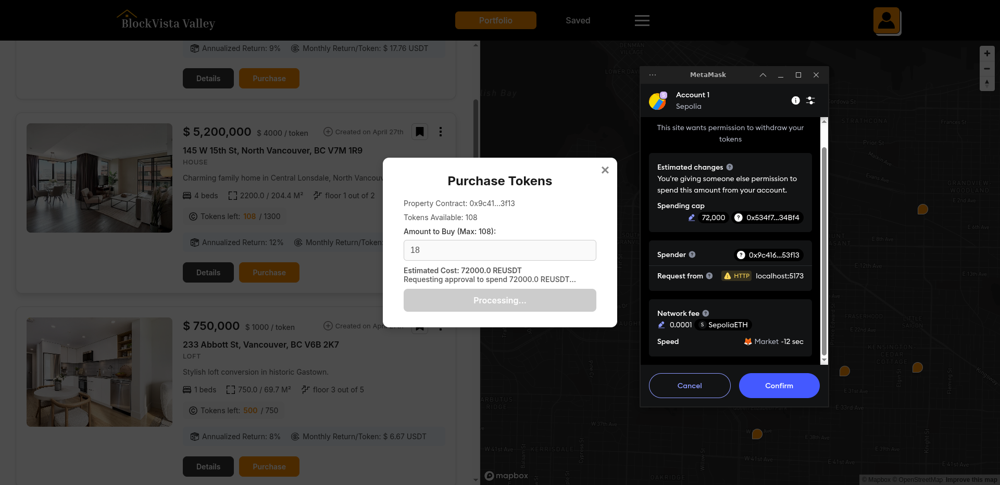

# Crypto Real Estate Platform

A modern real estate tokenization platform that utilizes ERC-1155 for fractional token distributions and includes a custom ERC-20 token. (Solana integration planned for future releases)

### All smart contracts for this repository can be found in this repository: 

- https://github.com/nemanull/crypto_real_estate_platform_smart_contracts


## Setup Guide

### Backend Setup

```bash
cd back
npm i
npx prisma migrate dev --name init # Creates the Prisma database
```

### Frontend Setup

```bash
cd front
npm i
```

### Environment Configuration

Create or use the following `.env` files in their respective directories:

#### Front-end Environment (front/.env)

```
VITE_MAPBOX_ACCESS_TOKEN=your_mapbox_access_token
VITE_PAYMENT_TOKEN_ADDRESS=USDT_or_custom_ERC20_payment_token_address
```

#### Back-end Environment (back/.env)

```
SESSION_SECRET_KEY=your_secret_key
GOOGLE_CLIENT_ID=your_google_client_id
GOOGLE_CLIENT_SECRET=your_google_client_secret
CALLBACK_URL=http://localhost:3000/api/auth/google/callback # Add this URL to your Google API console
DATABASE_URL="file:./demonstrational.db" # Database filepath - keep as is for demonstration purposes
SEPOLIA_RPC_URL=your_sepolia_rpc_url
PAYMENT_TOKEN_CONTRACT_ADDRESS=ERC20_token_payment_address
PROPERTY_FACTORY_CONTRACT_ADDRESS=propertyFactory_deployed_address
BACKEND_PRIVATE_KEY="Let's imagine this is a private key, it's just a placeholder for now"
```

### Running the Project

Both front-end and back-end can be started using:

```bash
npm run dev
```

This command can be customized in the respective package.json files.

### Backend Behavior

On each startup, the backend will reset the database by removing all properties and creating test properties from the `back/prisma/test_properties.json` file.

#### Example Property Data Structure:

```json
{
  "onchainId": 0,
  "onchainAddress": "0xfE8bf67966cA4C204e7A1C5F1cf8AB297096C3F1",
  "metadataHash": "0x881f002fec864a2d44670d6ffc5f4885c8f57996080181bf2f59fd3ff277d63f",
  "imageUrl": "/media/property_media/1.jpg",
  "totalTokens": 500,
  "tokensLeft": 345,
  "pricePerTokenWei": "2368000000000000000000",
  "annualReturnBp": 900,
  "priceUsdTotal": 1184000,
  "priceUsdPerToken": 2368,
  "monthlyReturnUsd": 17.76,
  "addressLine1": "1080 W Georgia St",
  "city": "Vancouver",
  "province": "BC",
  "postalCode": "V6E 4M3",
  "propertyType": "Condominium",
  "description": "Luxury condo in the heart of downtown with stunning city views.",
  "bedrooms": 2,
  "bathrooms": 2,
  "areaSqft": 950,
  "areaSqm": 88.3,
  "floor": "15",
  "floorsTotal": 48
}
```

### Investment Process
1. User browses properties on the frontend; UI fetches data from the REST API.
2. User clicks “Invest” and the frontend triggers their wallet to approve the ERC‑20 payment token.
3. Wallet sends payment tokens to the `PropertyFactory` contract.
4. `PropertyFactory` allocates fractional ERC‑1155 tokens to the user’s address.
5. Backend updates ownership records and token balances in the database. `(In the future builds)`


## User Flow

1. **Login**  
    Description: User signs in on the root page.  
    

2. **Dashboard**  
    Description: Browse and select properties.  
    

3. **Purchase**  
    Description: Choose token amount and confirm.  
    


